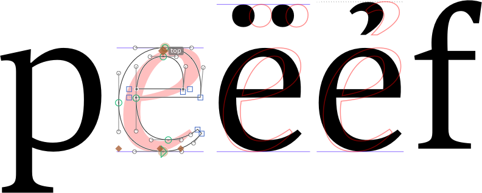

# ShowItalic.glyphsReporter

This is a plugin for the [Glyphs font editor](http://glyphsapp.com/) by Georg Seifert. It tries to display the italic (or upright) counterpart of the current glyph in Edit view, given that both the Upright and Italic fonts are opened in Glyphs, and given that the other font contains a glyph with the same name.

It is useful for stepping through the glyphs and checking if there is an undesired deviation, e.g., a different diacritic height or different descender depth.

After installation, it will add the menu item *View > Show Italic*. You can set a keyboard shortcut in System Preferences.

### Installation

1. Download the complete ZIP file and unpack it, or clone the repository.
2. Double click the .glyphsReporter file. Confirm the dialog that appears in Glyphs.
3. Restart Glyphs

### Usage Instructions

1. Open a glyph in Edit View.
2. Use *View > Show Italic* to toggle the display of the Italic.

### Requirements

The plugin works in Glyphs 2.2 or later, on OS X 10.11 or later. I can only test it in current app and OS versions, and perhaps it works on earlier versions too.

### License

Copyright 2016 Rainer Erich Scheichelbauer (@mekkablue).
Based on sample code by Georg Seifert (@schriftgestalt) and Yanone (@yanone).

Licensed under the Apache License, Version 2.0 (the "License");
you may not use this file except in compliance with the License.
You may obtain a copy of the License at

http://www.apache.org/licenses/LICENSE-2.0

See the License file included in this repository for further details.
